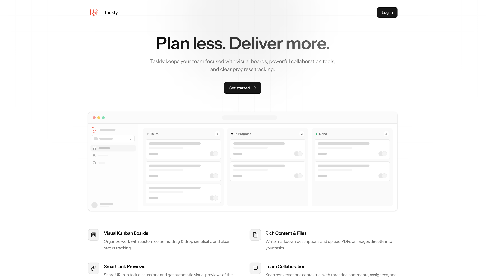

# Taskly

Taskly is a modern, collaborative task management application for teams. It allows teams to create, organize, and track tasks dynamically on an interactive Kanban board.

This project was bootstrapped from the official [Laravel Vue Starter Kit](https://github.com/laravel/vue-starter-kit).

## Demo

Short demo on YouTube: [Demo](https://youtu.be/Vk0FuN59XUE)



## Features

- **Interactive Kanban Board:** Drag-and-drop tasks between columns, rename columns, and adjust task priority sequences.
- **Advanced Task Filters:** Filter bar for finding tasks by:
  - Search keywords (debounced title & description search).
  - Assignee (filtered by specific team members or unassigned tasks).
  - Tags (multi-select filter).
  - Due Dates (shortcuts like Today, This Week, Overdue, or custom exact dates and date ranges).
- **Task Details & Collaboration:** 
  - Task editing with rich description styling (Tiptap editor), comments with threaded replies, and a detailed activity log timeline.
  - Discussion threads with nested replies.
  - Detailed activity log timeline for full auditability.
  - **Document Uploads:** Attach files directly to tasks (currently supporting Images and PDFs).
  - **Smart Link Previews:** Automatic, rich previews for URLs embedded in task descriptions and comments.
- **Workload Dashboard:** Team workspace overview featuring task metrics, urgent "To Handle Now" tasks, column breakdowns, and a recent activity feed.

## Tech Stack

- **Backend:** Laravel 12 (PHP >= 8.4), Inertia.js V3
- **Frontend:** Vue 3
- **Styling:** Tailwind CSS & Shadcn
- **CI/CD:** GitHub Actions workflow for automated testing, linting and deployment.
- **Deployment:** Docker, with a production-ready Dockerfile included in the repository.

## Installation

### Prerequisites

Make sure you have the following installed on your local system:
- **PHP** >= 8.4
- **Composer**
- **Node.js** >= 20
- **NPM**

### Getting Started

1. **Clone the repository** to your local environment.
2. **Install dependencies and seed the database:**
   ```bash
   composer run setup
   ```
   *This command installs Composer and JavaScript dependencies, initializes your `.env` configuration, generates the app key, and runs migrations with database seeds.*

3. **Start the development server:**
   ```bash
   composer run dev
   ```
   *This starts the Artisan server and the Vite dev server concurrently.*

4. Open [http://localhost:8000](http://localhost:8000) in your browser.

## Seeded Test Accounts

The seeded database contains **3 teams** and **8 users**, including a default **owner** and **admin** account. All accounts use the password `password`:

| Account | Email | Role | Teams |
| :--- | :--- | :--- | :--- |
| Owner | `owner@example.com` | Owner | All teams |
| Admin | `admin@example.com` | Admin | All teams |
| User 1, 2, 3 | `test1@example.com` to `test3@example.com` | Member | Team 1 |
| User 4, 5 | `test4@example.com` & `test5@example.com` | Member | Team 2 |
| User 6 | `test6@example.com` | Member | Team 3 |

- **Roles & Permissions:** Single-tenant permission model with three global roles (Owner, Admin, Member) with an active-team middleware & explicit team memberships.

## Roles & Permissions

Taskly ships with a single-tenant role model. Every account holds one of three **global roles**, and access to teams is granted through explicit **memberships**.

| Role | Scope | Can |
| :--- | :--- | :--- |
| **Owner** | Instance-wide | Everything: create/rename/delete teams, manage users, transfer ownership, promote/demote admins, add/remove members, configure columns |
| **Admin** | Instance-wide | Create & rename teams, add members, promote members, create users — but cannot delete teams or users, transfer ownership, demote other admins, or remove privileged members |
| **Member** | Team-scoped | Use tasks, tags and columns inside the teams they were explicitly added to |

### How access is scoped

- **Team membership is the source of truth.** A member's teams are stored in the `team_memberships` table. Privileged users (Owner/Admin) implicitly belong to **every** team, so they appear in every team's member list even without an explicit membership.
- **`users.team_id` is only the active-team context** (the team selected in the sidebar/Team Switcher), not a membership itself.
- **Access checks** go through `canAccessTeam()`: privileged users always pass; members must have a matching `team_memberships` row. This backs the `Task`, `Tag`, `Column` and `Team` policies, as well as file-attachment downloads.
- **Active-team middleware (`hasTeam`):** if a user has no active team, Admins/Owners are redirected to the team settings page and Members to a "pending" screen until an Admin adds them to a team.
- **Removing & demoting:** privileged users cannot be removed from a team (they always retain access). Demoting an Admin keeps them as an explicit member of the team the demotion happened in, so they don't silently vanish from the member list.
- **New teams** are bootstrapped with default columns (To Do, In Progress, Done), matching the seeder.

